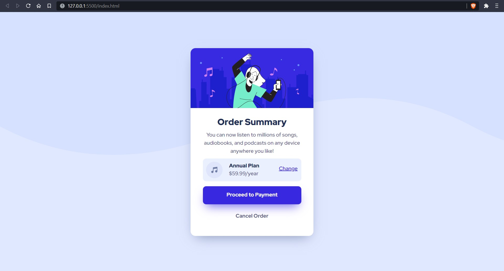

# Frontend Mentor - Order summary card solution

This is a solution to the [Order summary card challenge on Frontend Mentor](https://www.frontendmentor.io/challenges/order-summary-component-QlPmajDUj). Frontend Mentor challenges help you improve your coding skills by building realistic projects. 

## Table of contents

- [Overview](#overview)
  - [The challenge](#the-challenge)
  - [Screenshot](#screenshot)
  - [Links](#links)
- [My process](#my-process)
  - [Built with](#built-with)
- [Author](#author)

## Overview

### The challenge

Users should be able to:

- See hover states for interactive elements

### Screenshot

- Desktop 

- Mobile

### Links

- Solution URL: [Frontend-Mentor-Submission](https://www.frontendmentor.io/solutions/-semantic-html5-markup-css-custom-properties-flexbox-css-grid-yTdxt0xBh)
- Live Site URL: [Order-Summary-Component](https://hg8116.github.io/Order-summary-component/)

## My process

### Built with

- Semantic HTML5 markup
- CSS custom properties
- Flexbox
- CSS Grid

## Author

- Frontend Mentor - [@hg8116](https://www.frontendmentor.io/profile/hg8116)
- Twitter - [@HG8116](https://www.twitter.com/HG8116)
